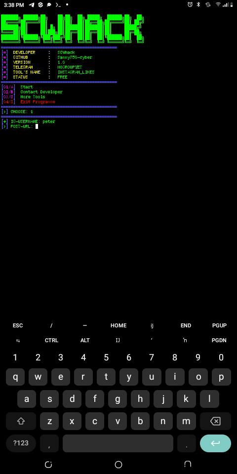

# Instagram-likes

This project is a Python-based application that helps manage Instagram likes.

## Features

- Manage Instagram likes
- Python-based implementation

## Installation

1. Clone the repository:
    ```sh
    git clone https://github.com/Sammy750-cyber/Instagram-likes.git
    ```
2. Navigate to the project directory:
    ```sh
    cd Instagram-likes
    ```
3. Install the required dependencies:
    ```sh
    pip install -r requirements.txt
    ```

## Usage

1. Run the application:
    ```sh
    python main.py
    ```

## Screenshots




## Contributing

1. Fork the repository.
2. Create a new branch:
    ```sh
    git checkout -b feature-branch
    ```
3. Make your changes and commit:
    ```sh
    git commit -m 'Add some feature'
    ```
4. Push to the branch:
    ```sh
    git push origin feature-branch
    ```
5. Open a pull request.

## License

This project is licensed under the [MIT License](LICENSE).

# If you enjoyed using this tool pls follow and give a star 🌟

## Thank you....
